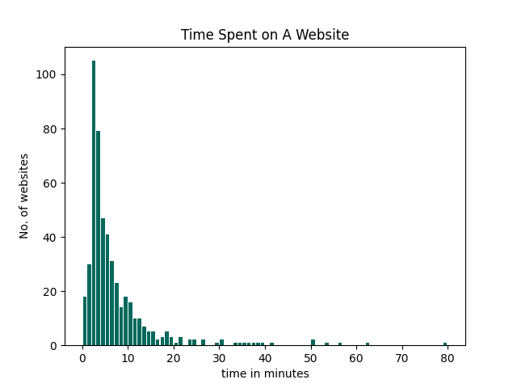

# Kenya Web Project

For a more complete picture of the process and a richer guide to the project, [find here](https://laudebugs.me/laudebugs.me/#/experiments/kenya-web-project).

For this simple project, I wanted to answer the question, are the websites that Kenyans access accessible to a populus that is keen on data consumption. I used, on average, 100MB of data and I could not afford to access websites that would use even 5MB on a single page. And therefore, the websites that used the least amount of data, but that were also fast were the ones I tended to access from day to day. WhatsApp is a good example of a situation where I would get the most value for the data I used. If I turned off automatic video and image downloads, I could spend just 10MB each day communicating with friends as opposed to using direct text messages that were more expensive (a bundle of 200 text messages from [Safaricom](https://niabusiness.com/buy-safaricom-sms-bundles/) would cost Kes 10, each with a limit of ~160 characters). Brings back memories of how I started to use short-forms like _imy_ and _gn_ among others to use every single character of a text message.

## The Dataset
The dataset consists of the top 499 websites in Kenya according to Alexa obtained on 4th July 2020. For each website, I performed a lighthouse report and added two key value pairs to the json describing the website, i.e. the performance and the size of the website on download. This dataset if found at [data/combinedWebData.json](data/combinedWebsiteData.json)
```json
{
    "daily pageviews per visitor": "10.00",
    "% of Traffic From Search": "28.30%",
    "site": "Kabarak.ac.ke",
    "rank": 257,
    "Size of page downloaded": "45,606KB",
    "daily time on site": "23:23",
    "performance": 0.04,
    "total Sites Linking In": "139"
  }
```
For each website, the full lighthouse report is also available in the data/complete-reports folder.
<hr/>

## Project Stages and Guide on DIY steps

1. Data Collection and Preparation
   I gathered data from Alexa of the 500 most popular websites in Kenya [here](rawWebsiteData.txt).<br/>
   To parse the data, I ran a simple [java script](Split.java) to transform the dataset into json format [here](websiteData.json)<br/>
   ```bash
   # compile the java program
   javac Script.java
   # run the java file
   java Script
   ```
   Now we are ready to use the dataset to generate reports
2. Generating reports. Borrowing heavily from this [multiple-lighthouse](https://github.com/sahava/multisite-lighthouse) repository, I modified the code to accept a json file that contained the websites. I have a far more detailed process on generating reports on [this blog post](). Since my personal pc didn't have the raw power to generate all the reports at once, I ran the script `runLightHouse.js` on an AWS server and generated this [file](websiteData-n-reports.json). I also stored the full lighthouse reports for all the websites [here](complete-reports).<br/>
   To generate the reports locally and append the performance score and data download onto the json defining one site:

   ```bash
   # install dependencies
   npm i
   # run script - the sampleRunLightHouse.js file will run lighthouse reports on only 5 websites
   node scripts/sampleRunLightHouse.js

   # To generate reports for all the websites, (only if you have a very powerful machine )
   node scripts/runLightHouse.js
   ```

3. Examining the data
Several scripts are available to generate visual representations of the dataset. 
All the scripts require python's matplotlib library
   ```bash
   pip3 install matplotlib
   ```
The scripts are made available in the analysis folder. Each script should be run from the home directory. For instance:
   ```bash
   # To run the time Spent on website graph script:
   python3 analysis/timeSpent.py
   ```
   
We can see that on average, Kenyans spend 7.2682 minutes on a website with the most common time spent on a site being 3 minutes according to the graph above⬆️.
### PostScript
The dataset made available still needs work. For instance, comparing the time spent on a particular website with another and doesn't take into account the fact that different websites serve different functions. For instance, a person logging into the Kenya Revenue Authority website would perhaps use the site for a specific predertemined use case while a person using YouTube might not have a goal in mind while using the site. And therefore, comparing how, for instance, the size of the page corelates with the amount of time spent makes a lot of assumptions such as the function of each site. <br/>

However, I am glad to make the dataset available, free to use and for more research to be done. Especially at a time when the internet is crucial to keep systems moving during Covid-19, we need to examine more closely how Kenyans use the internet.

## Future Work
- [ ] Label each website according to category such as entertainment, utility, education to be able to examine the dataset in more detail.
- [ ] Analyze how sites in a certain group or category compare with each other.
